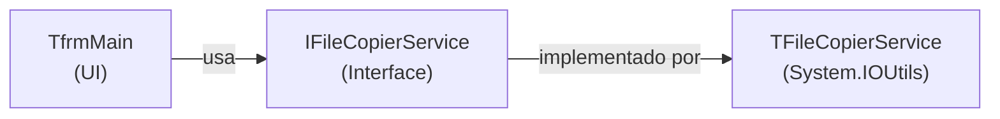

# File Copy Application — Walkthrough

## What was created

VCL application in `examples/file-copy-app/` with 4 files:

| Archive | Description |
|---------|-----------|
| [FileCopy.dpr](file:///c:/i9/Palestras/ACBr/delphi-spec-kit/examples/file-copy-app/FileCopy.dpr) | Delphi Project |
| [FileCopy.Main.View.pas](file:///c:/i9/Palestras/ACBr/delphi-spec-kit/examples/file-copy-app/FileCopy.Main.View.pas) | Main Form (UI) |
| [FileCopy.Main.View.dfm](file:///c:/i9/Palestras/ACBr/delphi-spec-kit/examples/file-copy-app/FileCopy.Main.View.dfm) | Form layout |
| [FileCopy.Service.Copier.pas](file:///c:/i9/Palestras/ACBr/delphi-spec-kit/examples/file-copy-app/FileCopy.Service.Copier.pas) | Copy service (logic) |

## Architecture

- **SRP**: Copy logic is isolated in `TFileCopierService`, separate from the UI
- **DIP**: The form depends on the `IFileCopierService` interface, not the concrete class
- **ARC**: The service is managed by interface — no need for `Free`

## Features

1. **Select source folder** — `TFileOpenDialog` with `fdoPickFolders`
2. **List files** — automatically displays in `TListBox` when selecting source
3. **Select destination folder** — creates the directory if it does not exist
4. **Copy with progress** — `TProgressBar` + `TStatusBar` updated via callback
5. **Guard clauses** — validations before copying (empty folders, no files)

## How to compile and test

1. Open `FileCopy.dpr` in RAD Studio
2. **F9** to compile and run
3. Select a folder with files as source
4. Select a destination folder
5. Click **"Copy Files"** and track the progress
