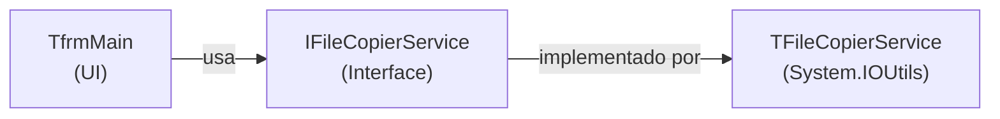

# File Copy Application — Walkthrough

## O que foi criado

Aplicação VCL em `examples/file-copy-app/` com 4 arquivos:

| Arquivo | Descrição |
|---------|-----------|
| [FileCopy.dpr](file:///c:/i9/Palestras/ACBr/delphi-spec-kit/examples/file-copy-app/FileCopy.dpr) | Projeto Delphi |
| [FileCopy.Main.View.pas](file:///c:/i9/Palestras/ACBr/delphi-spec-kit/examples/file-copy-app/FileCopy.Main.View.pas) | Form principal (UI) |
| [FileCopy.Main.View.dfm](file:///c:/i9/Palestras/ACBr/delphi-spec-kit/examples/file-copy-app/FileCopy.Main.View.dfm) | Layout do form |
| [FileCopy.Service.Copier.pas](file:///c:/i9/Palestras/ACBr/delphi-spec-kit/examples/file-copy-app/FileCopy.Service.Copier.pas) | Service de cópia (lógica) |

## Arquitetura

- **SRP**: A lógica de cópia está isolada em `TFileCopierService`, separada da UI
- **DIP**: O form depende da interface `IFileCopierService`, não da classe concreta
- **ARC**: O service é gerenciado por interface — sem necessidade de `Free`

## Funcionalidades

1. **Selecionar pasta de origem** — `TFileOpenDialog` com `fdoPickFolders`
2. **Listar arquivos** — exibe automaticamente no `TListBox` ao selecionar a origem
3. **Selecionar pasta de destino** — cria o diretório se não existir
4. **Copiar com progresso** — `TProgressBar` + `TStatusBar` atualizados via callback
5. **Guard clauses** — validações antes de copiar (pastas vazias, sem arquivos)

## Como compilar e testar

1. Abrir `FileCopy.dpr` no RAD Studio
2. **F9** para compilar e executar
3. Selecionar uma pasta com arquivos como origem
4. Selecionar uma pasta de destino
5. Clicar **"Copiar Arquivos"** e acompanhar o progresso
